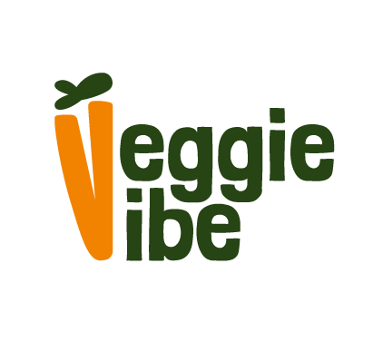

# VeggieVibe
VeggieVibe es una aplicación móvil diseñada para facilitar el acceso de personas vegetarianas y veganas a una variedad de restaurantes y productos especializados. A través de la plataforma, los usuarios pueden descubrir y pedir comida o productos de forma sencilla, con la comodidad de recibirlos a domicilio, ajustándose a sus preferencias alimenticias.

# Tecnologías utilizadas

- **Flutterflow**: Plataforma no-code utilizada para el desarrollo de nuestra aplicación.
- **Miro**: Herramienta empleada para la investigación del segmento objetivo, benchmarking y la creación de mapas visuales.
- **Google Forms**: Plataforma en la que realizamos encuestas a nuestros segmentos objetivos.

## Funcionalidades
La aplicación incluye las siguientes características:

 - Registro de usuarios
 - Inicio de sesión
 - Visualización de pedidos del usuario
 - Búsqueda y filtrado por comida, supermercado, producto y restaurante
 - Descripción detallada de supermercados, productos, restaurantes y tipos de comida
 - Pago de producto
 - Visualización de perfil del usuario
 - Modo oscuro

## Enlace de la investigación:
https://miro.com/welcomeonboard/b3NHMXMzYnlnUzFLUzluNmhhS1pJN004SzhMNjR1enVtcGl4YzFka21NZ3RFOG5vWnJPWFlDT2lVQUJHTWdKZnwzMDc0NDU3MzUwNzg3MDExNjQ4fDI=?share_link_id=932621307957

## Visualización del Proyecto: 

# Colaboradores del Proyecto:

- UX: Micaela Santana https://www.linkedin.com/in/micaela-santana-84b8861aa/
- UX: Andrea Garcia https://www.linkedin.com/in/andrea-garcia-b1b61b310/ 
- UX: Santiago Terragni https://www.linkedin.com/in/santiago-terragni
- UX: Mariano Poulsen https://www.linkedin.com/in/mariano-poulsen-5a93a2226/